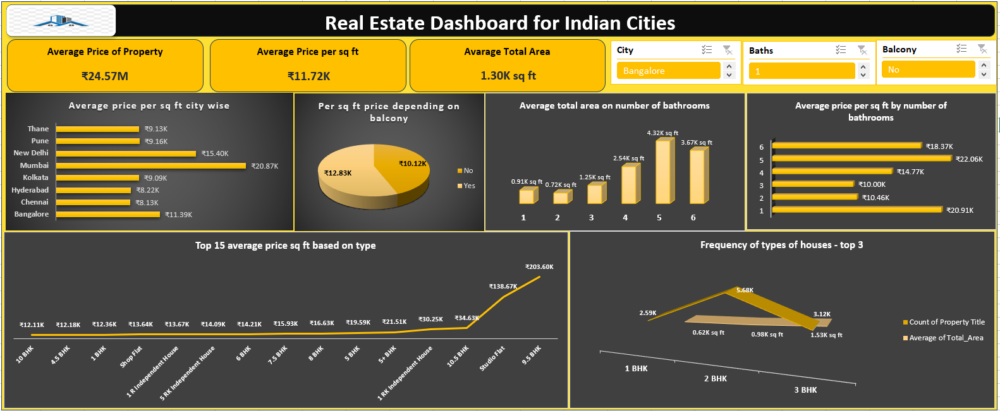

# 🏠 Real Estate Dashboard (Excel Project)

## 📌 Overview
An **interactive Excel dashboard** analyzing **real estate prices across major Indian cities**.  
It highlights **city-wise comparisons, property types, and the effect of features like balconies and bathrooms** on property value.  

---

## 📊 Key Insights
- 💰 **Average Property Price**: ₹24.57M  
- 📏 **Average Price per sq. ft**: ₹11.72K  
- 📐 **Average Property Area**: 1.30K sq. ft  
- 🌆 **City-wise Trends**:  
  - Mumbai → ₹20.87K/sq. ft (highest)  
  - Chennai & Hyderabad → ~₹8K/sq. ft (lowest)  
- 🚪 **Balcony Impact**: ₹12.83K/sq. ft (with) vs ₹10.12K (without)  
- 🚿 **Bathrooms Impact**: More bathrooms = larger size & higher price per sq. ft  
- 🏢 **Top Property Types**: Studio flats (₹138K/sq. ft), 9.5 BHK (₹203K/sq. ft)  
- 📊 **Most Common Types**: 1BHK, 2BHK, 3BHK  

---

## 🛠️ Tools Used
- **Microsoft Excel**  
  - Pivot Tables & Charts  
  - Slicers for interactivity  
  - Data Cleaning & Visualization  

---

## 📸 Dashboard Preview
  

---

## 🚀 Use Case
✅ Buyers & Investors → Compare cities & property types before investing  
✅ Real Estate Companies → Analyze pricing & market demand  
✅ Students/Analysts → Practice Excel dashboarding & storytelling  

---
